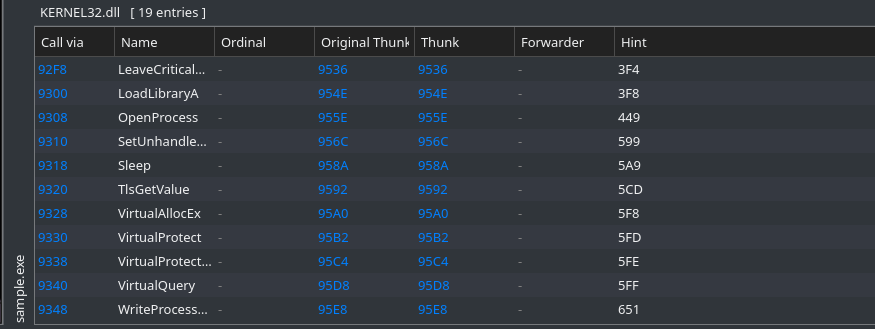
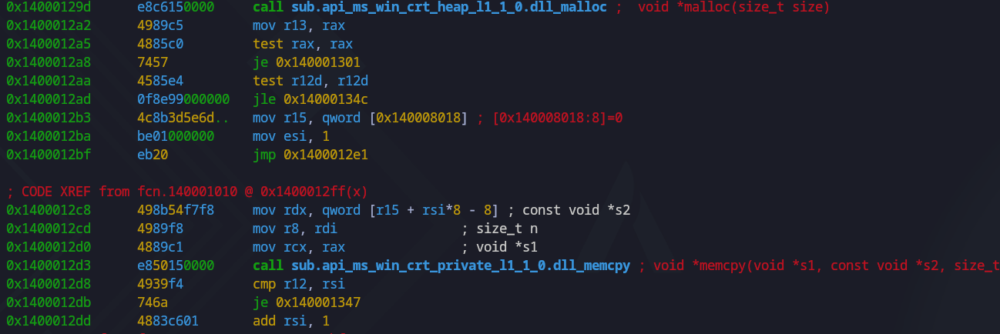
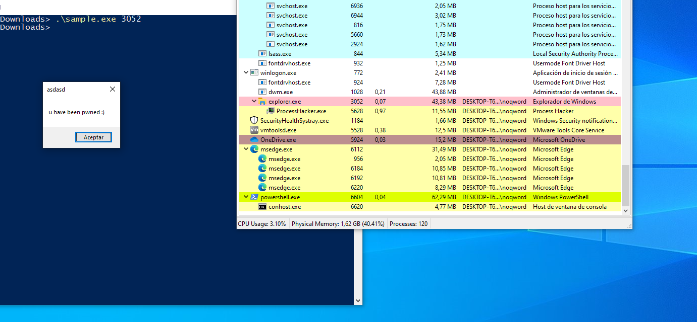

Hello everyone, in this series I would like to document my learning process on malware analysis step by step, from the basics to advancing my skills.

In this post, I will statically and dynamically analyze a simple sample of a process injection that uses the Win32 API to inject shellcode(execute MessageBoxA) into a process.
```shell
md5: 9f48c935f2ecc9001a7beaa3189b9d2c
```
## Static analysis

First, since it is a PE file, executable for Windows, I will use PE-Bear to analyze its structure.



Looking at imports, we see that it has 19 entries in KERNEL32.dll.

```shell
OpenProcess - open a target process
VirtualAllocEX - alloc virtual memory on proc
WriteProcessMemory - write shellcode into that memory
VirtualProtectEx - turn memory section RX
```

This is a simple and classic detectable workflow that injectors follow to execute instructions in the memory of another process.

#### Use radare2 to obtain the shellcode in the .data section.

To obtain the address where the shellcode is located, we have to establish an entry point. In this case, since it is so simple, we can obtain the entry point in the function fcn.140001010(main).

After a little analysis of the disassembly, we can see this fragment of instructions:



call `sub.api_ms_win_crt_private_l1_1_0.dll_memcpy ; void *memcpy(void *s1, const void *s2, size_t n)`  refers to the WriteProcessMemory call, where the shellcode is copied into the created section.

Now we trace the R15 and RSI registers to determine the offset of the address where *s2(shellcode) is stored.

```python
>>> hex(0x140008018-0x4efb)
'0x14000311d'
```

```
0x140001010]> px 256 @ 0x14000311d
- offset -   1D1E 1F20 2122 2324 2526 2728 292A 2B2C  DEF0123456789ABC
0x14000311d  8088 0000 0048 85c0 7467 4801 d050 8b48  .....H..tgH..P.H
0x14000312d  1844 8b40 2049 01d0 e356 4d31 c948 ffc9  .D.@ I...VM1.H..
0x14000313d  418b 3488 4801 d648 31c0 41c1 c90d ac41  A.4.H..H1.A....A
0x14000314d  01c1 38e0 75f1 4c03 4c24 0845 39d1 75d8  ..8.u.L.L$.E9.u.
0x14000315d  5844 8b40 2449 01d0 6641 8b0c 4844 8b40  XD.@$I..fA..HD.@
0x14000316d  1c49 01d0 418b 0488 4158 4158 5e59 4801  .I..A...AXAX^YH.
0x14000317d  d05a 4158 4159 415a 4883 ec20 4152 ffe0  .ZAXAYAZH.. AR..
0x14000318d  5841 595a 488b 12e9 4bff ffff 5de8 0b00  XAYZH...K...]...
0x14000319d  0000 7573 6572 3332 2e64 6c6c 0059 41ba  ..user32.dll.YA.
0x1400031ad  4c77 2607 ffd5 49c7 c100 0000 00e8 1500  Lw&...I.........
0x1400031bd  0000 7520 6861 7665 2062 6565 6e20 7077  ..u have been pw
0x1400031cd  6e65 6420 3a29 005a e807 0000 0061 7364  ned :).Z.....asd
0x1400031dd  6173 6400 4158 4831 c941 ba45 8356 07ff  asd.AXH1.A.E.V..
0x1400031ed  d548 31c9 41ba f0b5 a256 ffd5 0000 0000  .H1.A....V......
```

We already have the shellcode. In the future, I will explain how we can dump the opcodes and disassemble them to obtain the actual instructions (only if it is raw in the code).

## Dynamic Analisis

For the dynamic analysis, I will be using a Windows 10 lab.

I use Process Hacker. I do not plan to do an exhaustive analysis because, in this case, it is a simple shellcode that calls MessageBoxA.



Here you can see how the sample code calls the messagebox within another process. Let's analyze this a little further.


You can see how a new memory section with RX permissions (PAGE_EXECUTE_READ) has been created. Upon analyzing it, we see that the hexadecimal value matches the one we obtained in the static analysis.

[OpenProcess](https://learn.microsoft.com/en-us/windows/win32/api/processthreadsapi/nf-processthreadsapi-openprocess)
[VirtualAllocEx](https://learn.microsoft.com/en-us/windows/win32/api/memoryapi/nf-memoryapi-virtualallocex)
[WriteProcessMemory](https://learn.microsoft.com/en-us/windows/win32/api/memoryapi/nf-memoryapi-writeprocessmemory)

Thanks for reading this far and apologies for my non-technical language (I'm not very good at it)...


